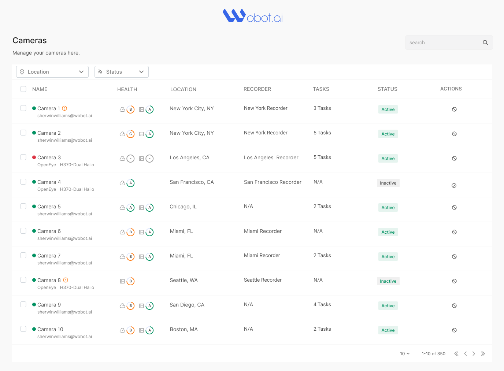

# Camera List Table - Frontend Assignment

## Project Overview

This project is a React-based implementation of a camera list table with various functionalities as per the assignment requirements for Wobot Intelligence Private Limited.

## Features

1. **Data Integration**

   - Fetches and displays camera data from the provided API endpoint
   - Integrates status update API for switching camera status

2. **Core Features**

   - Pagination: Frontend-based navigation through the dataset
   - Search & Filter: Frontend-only search and filtering functionalities
   - Delete Action: Ability to remove camera entries from the table

## Design Reference

The implementation should match the following design:

## API Endpoints

1. Get list: `https://api-app-staging.wobot.ai/app/v1/fetch/cameras`
2. Update status: `https://api-app-staging.wobot.ai/app/v1/update/camera/status`
   - Payload: `{ id: 2, status: "Active" / "Inactive" }`
3. Authentication: Bearer token-based
   - Token: `4ApVMIn5sTxeW7GQ5VWeWiy`

## Setup Instructions

1. Clone the repository:
   git clone [repository-url]

2. Navigate to the project directory:
   cd [project-directory]

3. Install dependencies:
   npm install

4. Start the development server:
   npm start

5. Open your browser and visit `http://localhost:3000` to view the application.

## Deployment

The project is deployed and accessible at: [Deployment URL]

## Repository

The source code is available at: [GitHub Repository URL]

## Technologies Used

- React
- [Any additional libraries or frameworks used]

## Code Structure

[Brief explanation of the project's file structure and main components]

## Additional Notes

- This project is frontend-only; all functionalities are handled on the client-side.
- The UI is designed to be responsive and user-friendly.
- Code is written with a focus on cleanliness, modularity, and reusability.

## Contact

For any queries regarding this assignment, please contact [Your Contact Information].

---

**Note:** This assignment is confidential and should not be shared on social platforms.
